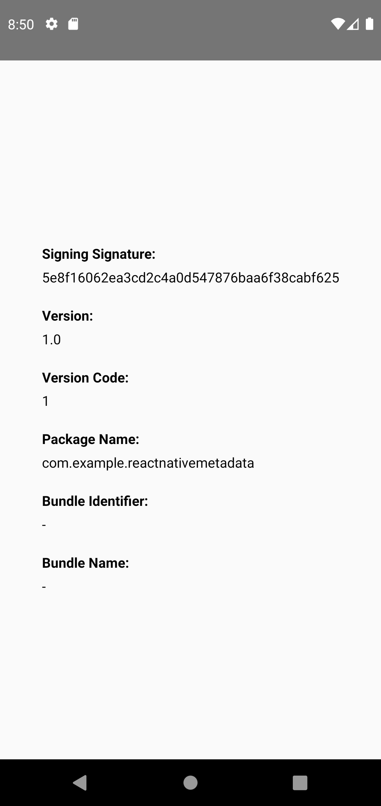
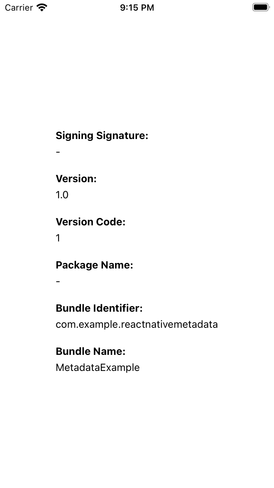

# react-native-metadata

> Ability to retrieve app metadata.

## Installation

```sh
npm install react-native-metadata

# install pods for ios
npx pod-install ios
```

Autolinking takes care of the rest.

## Usage

```js
import Metadata from 'react-native-metadata';

// ...

const {
  signingSignature,
  version,
  shortVersion,
  packageName,
  bundleIdentifier,
  bundleName,
} = Metadata;
```

## Example

| Android                                                   |                        iOS                        |
| --------------------------------------------------------- | :-----------------------------------------------: |
|  |  |

## Contributing

See the [contributing guide](CONTRIBUTING.md) to learn how to contribute to the repository and the development workflow.

## License

MIT
